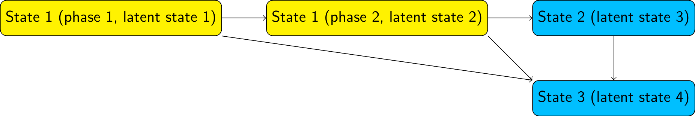

# Phase-type semi-Markov models

In a multi-state model, suppose we do not believe the sojourn time in a particular state follows an exponential distribution.  For example, in the infection model, suppose we do not believe that the time spent in the "test positive" state is exponential. 

```{r,echo=FALSE,out.width="500px"}
knitr::include_graphics("../man/figures/twostate.png")
```

We can relax this assumption by building a **"semi-Markov"** model, where the sojourn time in this state follows a more complex distribution.    One way to do this is to replace this state by a series of two (or more) latent or hidden states, known as "phases".  For example, with two phases: 

```{r,echo=FALSE,out.width="600px"}
knitr::include_graphics("../man/figures/twostatephase.png")
```

> In a phase-type model, we allow progression from one phase to the next, but not transitions from later to earlier phases (or jumps between non-adjacent phases, if there are 3 phases or more).    Otherwise, we allow the same transitions out of each phase as were allowed in the original model (to state 1, in this example)

We then assume transitions between and out of the phases follow exponential distributions.  That is, we assume a Markov model on the latent state space.  The test-positive state then has a sojourn distribution known as the ["Coxian" phase-type](https://en.wikipedia.org/wiki/Phase-type_distribution#Coxian_distribution) distribution, instead of the exponential.

> **Note**: This is an example of a **hidden Markov model**, though one of a specific form where some states are observed correctly, and some states are latent.  Phase-type models are a convenient way to build semi-Markov models for intermittently-observed data, because there are standard algorithms for computing the likelihood of a hidden Markov model.


# Fitting phase-type models in msmbayes

To assume a phase-type sojourn distribution for one or more states in a `msmbayes`
model, set the `nphase` argument.  This is a vector of length equal to the number of states, giving the number of phases per state.  Any elements of `nphase` that are 1 correspond to states with the usual exponential sojourn distribution.


## Example: data simulated from a standard Markov model

Here we extend the 2-state model for the simulated infection data to give state 2 (infection) a two-phase sojourn distribution.   These data were originally simulated assuming an exponential sojourn distribution in state 2 (with rate 3).   In this situation, we would expect the estimated rates of transition out of each phase to be identical.

```{r}
library(msmbayes)
```

```{r,cache=TRUE,results="hide"}
Q <- rbind(c(0, 1), 
           c(1, 0))
draws <- msmbayes(infsim2, state="state", time="months", subject="subject",
                  Q=Q, nphase=c(1,2))
```

```{r}
summary(draws)
```

The phased states are labelled specially here, e.g. the first phase of state 2 is labelled `"2p1"`. The estimated transition rates from the two phases of state 2 to state 1 are not significantly different from 2 - but there is large uncertainty around the estimated rates, since this model is over-fitted to the data. Implementing the same model in `msm` would give extremely large confidence intervals around the estimated rates.


## Example: data simulated from a phase-type model 

The following code simulates a dataset from the following phase-type model structure 

```{r,echo=FALSE,out.width="600px"}

```

with a transition intensity matrix (on the latent state space) given in the R object `Qg`.  This code uses the ability of the function `simmulti.msm()` from the `msm` package to simulate from hidden Markov models.
```{r}
Qg <- rbind(c(0, 0.18, 0.008, 0.012),
            c(0, 0,    0.016, 0.024),
            c(0, 0,    0,     0.2),
            c(0, 0,    0,     0))
E <- rbind(c(1,0,0,0), # hidden Markov model misclassification matrix
           c(1,0,0,0),
           c(0,1,0,0),
           c(0,0,1,0))
nsubj <- 10000; nobspt <- 10
set.seed(1)
sim.df <- data.frame(subject = rep(1:nsubj, each=nobspt),
                     time = seq(0, 100, length=nobspt))
library(msm)
sim.df <- simmulti.msm(sim.df[,1:2], qmatrix=Qg, ematrix=E)
```

We fit the phase-type model to the simulated data using both `msmbayes` and `msm`.

The `"pathfinder"` variational inference algorithm is used to approximate the Bayesian posterior.  There are some warning messages from using this algorithm in this example, so in practice we might have wanted to cross-check the results with MCMC.

```{r,cache=TRUE,results="hide",warning=FALSE,error=FALSE,message=FALSE}
Q3 <- rbind(c(0,1,1),c(0,0,1),c(0,0,0))
draws <- msmbayes(data=sim.df, state="obs", time="time", subject="subject",
                  Q=Q3, nphase=c(2,1,1), fit_method="pathfinder")
bayesplot::mcmc_dens(draws, pars=sprintf("logq[%s]",1:6))
```

The posterior distribution appears awkwardly shaped, with evidence of
several local maxima or "saddle points".

`msm` needs some tuning to converge, in particular the use of `fnscale` and 
explicit initial values for the transition rate.  In practice, sensitivity analysis
to these initial values would be needed to confirm that the reported estimates are
the global maximum likelihood estimates, rather than one of the local maxima or
saddle points.

```{r,cache=TRUE,results="hide"}
Q3 <- rbind(c(0,0.5,0.5),c(0,0,0.5),c(0,0,0))
s.msm <- msm(obs ~ time, subject=subject, data=sim.df, phase.states=1, qmatrix=Q3,
             phase.inits=list(list(trans=0.05,  # seems to need these
                                   exit=matrix(rep(0.05,4),nrow=2,byrow=TRUE))),
             control = list(trace=1,REPORT=1,fnscale=50000,maxit=10000))
```

Reassuringly, the Bayesian and frequentist methods give similar estimates of the transition intensities, which agree (within estimation error) with the values used for simulation. 

```{r}
qmatrix(draws)
qmatrix.msm(s.msm,ci="none")
Qg
```

The mean sojourn times in states of a phase-type model can either be calculated for the latent state space (`by_phase=TRUE`, the default), or the observable state space (`by_phase=FALSE`). 
```{r}
mean_sojourn(draws)
mean_sojourn(draws, by_phase=FALSE) 
```

More practical experience of using these phase-type models is needed.  In particular:

* How to specify substantive prior information.  In the examples above, the default
log-normal(-2,2) priors were used for transition intensities.  But we need a better 
way to choose these based on judgements about interpretable quantities, e.g. the mean sojourn time in the phased state.

* Limited experience suggests that the Bayesian method is more likely than `msm` to produce a plausible result without the need for tuning.   However, can the sampling algorithms always be relied upon?

* How to build and interpret models with covariates on intensities.  Covariates can be placed on intensities for transitions in the phased state-space, but this has not been tested in practice.  There is a risk of over-fitting, and strong constraints on covariate effects are expected to be necessary.


# Multi-state models with misclassification

Another application of hidden Markov models is to account for misclassification of states in a multi-state model. 

To fit a misclassification multi-state models in `msmbayes`, the structure of allowed misclassifications is supplied in the `E` argument (the "e" stands for "emission"). This is a matrix with off-diagonal entries: 

* 1 if true state [row number] can be misclassified as [column number]

* 0 if true state [row number] cannot be misclassified as [column number]

The diagonal entries of `E` are ignored (as for the `Q` argument).

The following example is discussed in the [`msm` user guide](https://cran.r-project.org/web/packages/msm/vignettes/msm-manual.pdf) (Section 2.14).  We model progression between three states of CAV (a disease experienced by heart transplant recipients), and allow death from any of these states.   True state 1 can be misclassified as 2, true state 2 can be misclassified as 1 or 3, and true state 3 can be misclassified as 2. 

For speed in this demo, we use Stan's `"optimize"` method, which simply determines the posterior mode, and no other posterior summaries.

```{r,results="hide"}
Qcav <- rbind(c(0, 1, 0, 1),
              c(0, 0, 1, 1), 
              c(0, 0, 0, 1),
              c(0, 0, 0, 0))
Ecav <- rbind(c(0, 1, 0, 0),
              c(1, 0, 1, 0),
              c(0, 1, 0, 0),
              c(0, 0, 0, 0))
draws <- msmbayes(data=cav, state="state", time="years", subject="PTNUM", 
                  Q=Qcav, E=Ecav, fit_method="optimize")
```

```{r}
qmatrix(draws)
```

The function `edf` extracts the misclassification (or "emission") probabilities in a tidy data frame form. 
```{r}
edf(draws)
```

An identical non-Bayesian model is fitted using `msm()`.

> **Note**: this is different from the model fitted in the `msm` manual, since "exact death times" are not supported in `msmbayes`.  Also note that `msm` requires informative initial values for the non-zero intensities and misclassification probabilities here. For hidden Markov models, `msm` is not smart enough to determine good initial values automatically given the transition structure.

```{r}
Qcav <- rbind(c(0, 0.148, 0, 0.0171), c(0, 0, 0.202, 0.081), 
              c(0, 0, 0, 0.126), c(0, 0, 0, 0))
Ecav <- rbind(c(0, 0.1, 0, 0),c(0.1, 0, 0.1, 0),
              c(0, 0.1, 0, 0),c(0, 0, 0, 0))
cav.msm <- msm(state ~ years, subject=PTNUM, data=cav, qmatrix=Qcav, ematrix=Ecav)
qmatrix.msm(cav.msm, ci="none")
ematrix.msm(cav.msm, ci="none")
```

The parameter estimates from `msm` are close to those from `msmbayes`, with any differences explainable by the influence of the weak prior.
